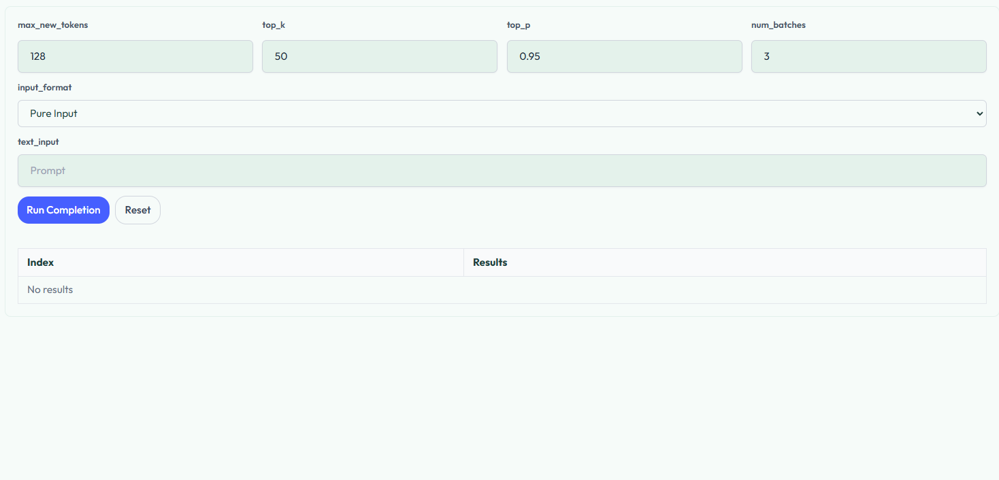

# Completion

### Overview
This page allows users to generate text completions from a given prompt and  decoding parametrs.

### Input
- **text_input** : the prompt text provided by the user
- **input_format** : defines the input format used by the model.
- **decoding parameters**
    - **max_new_tokens** : maximum number of tokens to generate
    - **top_k** : restricts the candidate tokens to the top k most probable tokens
    - **top_p** : restricts the candidate tokens to the smallest set whose cumulative probability exceeds p
    - **num_batches** : number of completions generated for the same prompt

### Output
 - Generated completions

### Example
