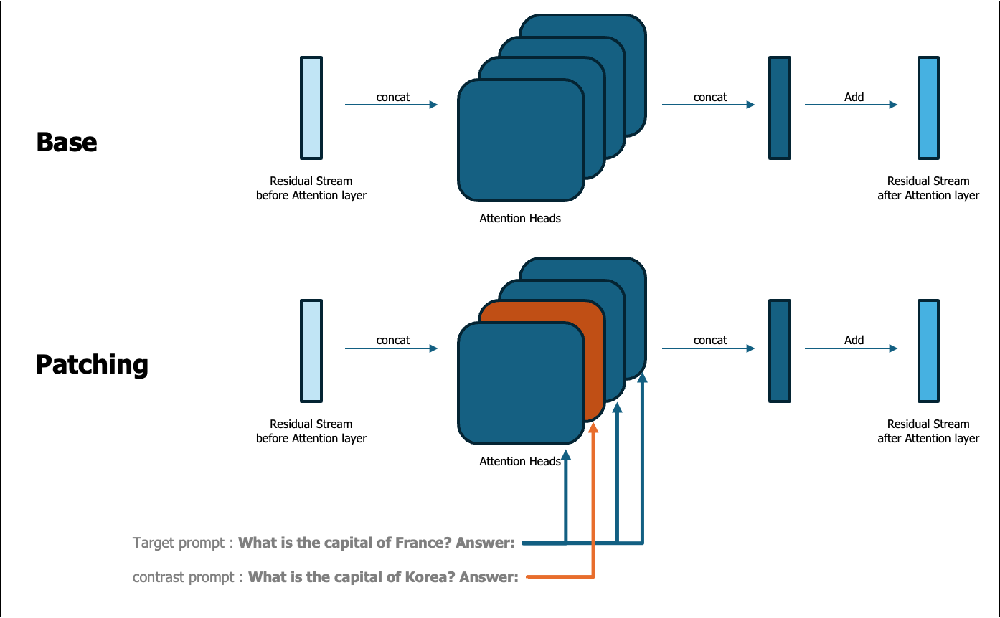
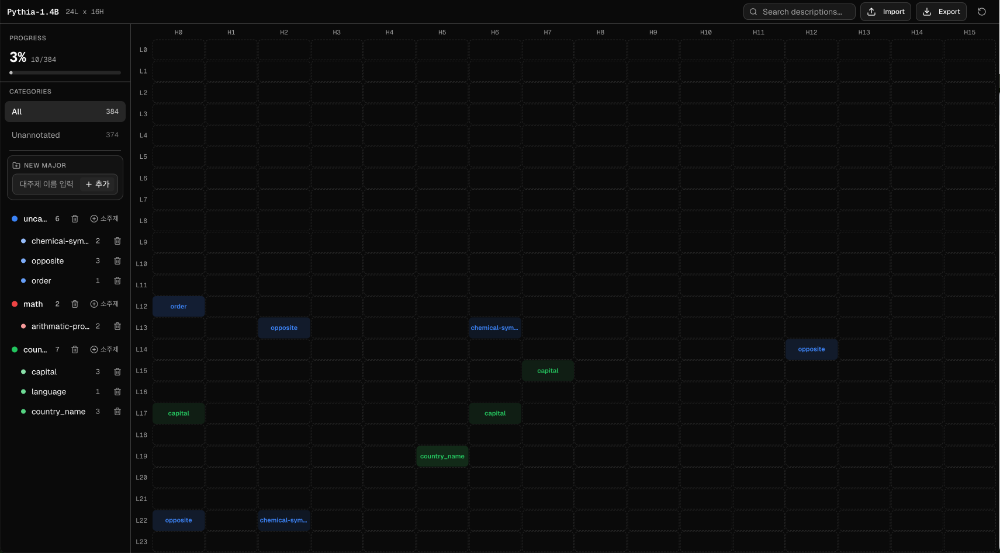

# Attention Head Coverage 

## 1. Introduction 

Transformer-based language models contain multiple attention heads in each layer, and these heads shape the model’s predictions through interactions between input tokens. However, it is difficult to directly observe from outside the model what specific function each individual head performs, or whether it is specialized for encoding certain types of knowledge or patterns. Understanding this internal structure is therefore a key challenge for improving the **interpretability** of Transformer models.

Previous interpretability studies have attempted to infer the functions of attention heads indirectly through attention weight visualization or probing classifiers. However, such approaches typically reveal **correlation** rather than demonstrating **causality**.

**Attention Head Coverage** proposes an experimental framework that quantitatively measures the **causal influence** of specific attention heads (or sets of heads) on the model’s **next-token prediction**. The framework intervenes directly in the model’s internal representations by replacing the hidden representation of a particular head with that from another input sample, and then observing how the output distribution changes.

The core assumption is as follows: 
> If a specific head plays a meaningful role in the model’s prediction process, replacing the representation of that head should cause the output to change in a consistent direction.

To interpret **what kind of information a head encodes**, we analyze **how much the output changes under intervention**, and infer the functional role of the head from these effects.

Furthermore, instead of relying on a single pair of prompts, we measure **statistical consistency across multiple prompts within the same category**. This allows us to distinguish accidental changes from structurally meaningful effects. The ultimate goal is to **automatically discover candidate attention heads that consistently influence predictions within a particular topic or prompt category.**

### Core Idea: Activation Patching

The core mechanism of Attention Head Coverage is **activation patching**. Each experiment proceeds in three stages:

 1. **Baseline Measurement**

    Each prompt is fed into the model, and the **baseline top-1 token** of the next-token prediction along with its probability is recorded.

 2. **Intervention**

    The hidden representation of a specific layer/head (more precisely, the **head output of the `attention.dense` input**) is **replaced** with the corresponding head output from a donor prompt.

 3. **Effect Measurement**

    The change in output probabilities before and after the patching is quantified in two directions:
       - decrease in the probability of the baseline top-1 token
       - increase in the probability of the donor prompt’s top-1 token
    
    These changes are measured to evaluate the influence of the head.

### Research Questions

This project aims to quantitatively answer the following three questions.

 - **Q1. Disruption** - When a specific head is patched, **to what extent does the baseline prompt’s top-1 prediction collapse?**
  
 - **Q2. Injection** - At the same time, **to what extent is the donor prompt’s top-1 prediction injected into the output?**

 - **Q3. Consistency** - Is this phenomenon **consistently reproduced across a large portion of the dataset** within a specific category?

## 2. Task Definition 

### 2.1 Problem Statement

Given a model $M$, consider a set of attention heads defined by their layer and head indices

$$
S = \{(l_1, h_1), \ldots, (l_k, h_k)\}
$$

This study aims to answer the following question:

> **Does the head set $S$ causally contribute to the model’s next-token prediction?**  
> If so, **does this contribution appear consistently across prompts within a specific prompt category?**

To address this question, we perform interventions on the hidden representations of selected attention heads and analyze the resulting changes in the model’s output distribution. 

Rather than focusing on individual prompt pairs, the analysis evaluates whether similar output changes repeatedly occur across multiple prompts within the same category. Consistent patterns of change across the dataset are interpreted as evidence that the attention head set plays a functional role in the model’s prediction process.

### 2.2 Input / Output Format

**[ Input Format ]**

The input data for the experiment consists of prompt files in `.jsonl` format.  
Each line contains a prompt in the following structure: `{"prompt": "..."}`

Prompts are grouped by category according to the dataset directory structure. Each dataset file contains only the prompt text, while metadata such as the prompt category and source file are automatically inferred by the experiment code from the dataset directory structure.

**[ Output Format ]**

The experiment results are saved in both **`.jsonl` and `.csv` formats**, containing the same information.  
Outputs are written per dataset bucket (`{category}/{source_file_stem}`), and each bucket contains the following primary files:

1. **prompt_output_map**

   Stores the baseline prediction results and the model outputs before any intervention for each prompt.  
   This includes the prompt text, the top-1 token predicted by the model in the baseline condition, and the probability of that token.

2. **prompt_by_head**

   Records probability changes and related statistics for each prompt under every attention head intervention.  
   This file provides detailed information about how a specific head intervention affects the prediction probability for each prompt.

3. **summary_by_head**

   Provides aggregated statistics for each attention head across multiple prompts.  
   Only layer–head pairs that satisfy threshold criteria are appended.  
   These heads are considered potential **topic-related attention heads** that may perform functional roles associated with specific topics or patterns.

The precise definitions of the evaluation metrics included in these outputs are described in **Section 2.4 (Evaluation Metrics)** and **Section 6 Appendix – “Identifying Topic-Related Attention Heads.”**

### 2.3 Patching Mechanism

Let the **base prompt** be denoted as $$x_i$$ and the **donor prompt** as $$x_j$$.
For illustration, consider the following example:
$$
x_i = \text{`What is the capital of France? Answer:'}, \quad
x_j = \text{`What is the capital of Korea? Answer:'}.
$$

The top-1 token for these prompts are

$$
y_i = \text{`Paris'}, \quad
y_j = \text{`Seoul'}
$$

The key idea of the **intervention mechanism** is straightforward.  
If a particular attention head plays an important role in representing a specific topic, then replacing that head's activation from the donor prompt should alter the model’s output distribution in a predictable way.

Specifically, if the head activation of the base prompt is replaced with that of the donor prompt, the probability (or rank) of the original answer $$y_i$$ should decrease, while the probability (or rank) of the donor answer $$y_j$$ should increase.

Formally, let $$h_k^{(l)}(x)$$ denote the activation of the $$k$$-th attention head at layer $$l$$ for input $$x$$.  
We perform the following intervention:
$$
h_k^{(l)}(x_i) \leftarrow h_k^{(l)}(x_j).
$$
After this intervention, we expect the following changes in the output distribution:
$$
P(\text{Paris} \mid x_i) \downarrow, \qquad
P(\text{Seoul} \mid x_i) \uparrow .
$$
To reliably identify heads that are strongly associated with a given topic, this phenomenon should occur **consistently across multiple prompts sharing the same topic**.

To facilitate this analysis, we construct prompts using a fixed template and vary only the key entity corresponding to the topic (e.g., the country name). This controlled setup allows us to isolate the contribution of individual attention heads to topic-specific representations.

### 2.4 Evaluation Metrics

The effect of an intervention is evaluated through **changes in the output probability distribution**.

**Notation**

Let
$$
\{x_i\}_{i=1}^{N}
$$

denote a dataset of prompts, where $$N$$ is the dataset size.

For each prompt $$x_i$$, let

$$
y_i = t(x_i; H_{base})
$$

denote the **top-1 token prediction** of the original model.

Here

$$
t(x_i; H)
$$

denotes the **top-1 predicted token** for prompt $$x_i$$ when using a set of attention heads $$H$$.

Similarly,

$$
p(y \mid x_i; H)
$$

denotes the **probability assigned to token $$y$$** under prompt $$x_i$$ when using head configuration $$H$$.

**Head Intervention**

Let $$S$$ denote a **set of attention heads** to be replaced.

For each prompt $$x_i$$, the donor prompt is chosen using circular indexing:

$$
j = (i+1) \bmod N
$$

The notation

$$
x_i; S_{x_j}
$$

denotes the prompt $$x_i$$ evaluated under a modified model where the heads in $$S$$ are replaced with the corresponding activations from donor prompt $$x_j$$.

**[1] Baseline Degradation**

We define the probability change of the baseline token $$y_i$$ after intervention as

$$
\Delta_{base}(x_i; S_{x_j})
=
p(y_i \mid x_i; S_{x_j})
-
p(y_i \mid x_i; H_{base})
$$

Using this quantity, the **ratio of prompts where the baseline token probability decreases** is defined as

$$
R_{base}^{\downarrow}(x_i,S_{x_j})
=
\frac{1}{N}
\sum_{i=1}^{N}
\mathbf{1}
\left[
\Delta_{base}(x_i; S_{x_j}) < 0
\right]
$$

**[2] Prediction Change Ratio**

We also measure the **ratio of prompts where the top-1 prediction changes after intervention**:

$$
R_{change}(x_i,S_{x_j})
=
\frac{1}{N}
\sum_{i=1}^{N}
\mathbf{1}
\left[
t(x_i; H_{base}) \ne t(x_i; S_{x_j})
\right]
$$

**[3] Donor Token Injection**

The change in the probability of the donor token is defined as

$$
\Delta_{donor}(x_i; S_{x_j})
=
p(y_j \mid x_i; S_{x_j})
-
p(y_j \mid x_i; H_{base})
$$

Using this value, the **ratio of prompts where the donor token probability increases** is defined as

$$ 
R_{donor}^{\uparrow}(x_i,S_{x_j}) =
\frac{1}{N}
\sum_{i=1}^{N}
\mathbf{1}[\Delta_{donor}(x_i; S_{x_j}) > 0]
$$  

**[4] Head Selection**

An attention head is selected as a **meaningful candidate head** when it satisfies all of the following conditions:

- baseline token probability decrease ratio ≥ `0.8`   (`base_token_prob_decrease_ratio`)  
- donor token probability increase ratio ≥ `0.8`   (`donor_token_prob_increase_ratio`)  
- donor token rank up ratio ≥ `0.8`   (`donor_token_rank_up_ratio`)  
- mean baseline token probability change < `-0.01`   (`base_token_prob_delta_mean`)

These conditions are designed to identify heads where the intervention **simultaneously degrades the baseline prediction while injecting donor information into the output distribution**.

### 2.5 Model

All experiments are conducted using the **EleutherAI Pythia-1.4B causal language model**. The model consists of **24 transformer layers**, each containing **16 attention heads**, resulting in **384 attention heads in total**.

The intervention point is the **hidden representation entering the attention output projection (`attention.dense`)** at each layer.  
At this point, the hidden output corresponding to a specific head is **replaced with the corresponding output from a donor prompt**, which constitutes the **activation patching** operation.
This activation patching procedure is used to **measure the causal influence of each attention head** on the model’s output.

Although the framework is validated on **Pythia-1.4B**, it is **not model-specific**. It can be applied to **any model following the standard Transformer architecture with multi-head self-attention**, provided that **layer-wise hidden representations of individual attention heads are accessible**.  

## 3. Main Figure  

The figure below presents an interactive visualization of the Attention Head Coverage results.

Rows correspond to **Transformer layers**, and columns correspond to **attention head indices**.  
Each cell represents a specific attention head $(l,h)$ in the model.

Heads that show significant effects for a particular prompt category are highlighted using **color-coded labels** within the grid.

The left panel summarizes discovered head groups, including:

- detected **semantic categories**
- the number of **attention heads associated with each category**
- a short **description of the role of those heads**

Categories are color-coded, allowing users to quickly identify where heads related to specific concepts (e.g., math, country) are distributed across layers and heads.

The visualization is provided through an **interactive web interface hosted via *vercel.app***.  

## 4. Results

The experimental results table is organized based on the five key metrics below.
- base_token_prob_delta_mean
- base_token_prob_decrease_ratio
- donor_token_rank_up_ratio
- donor_token_rank_pre_patching
- donor_token_rank_post_patching

Based on these metrics, we categorize the heads into two groups: strongly related heads and weakly related heads.

**Strongly related heads** exhibit consistent patterns across the metrics and show substantial and meaningful variability in their effects. In contrast, **weakly related heads** also demonstrate consistent patterns, but the magnitude of their variability is relatively small, indicating limited practical impact.

**capitals**

- Example Propmpt : `What is the capital of Italy? Answer:`
- Predicted next token : `Rome`

|head|prompt_count|base_token_prob_delta_mean|base_token_prob_decrease_ratio|donor_token_rank_up_ratio|donor_token_rank_pre_patching|donor_token_rank_post_patching|
|---|---|---|---|---|---|---|
|L15.H7|28|-0.201|0.9643|1|725.3214|7.3929|
|L17.H6|28|-0.0687|0.9643|1|725.3214|75.8571|
|L17.H0|28|-0.0186|0.8571|1|725.3214|376.2857|
|L23.H9|28|-0.0137|0.9286|0.8571|725.3214|670.8571|

- strongly related : L15.H7, L17.H6
- weakly related : L17.H0, L23.H9

**chemical_symbols**

- Example Propmpt: `The chemical symbol for Hydrogen is`
- Predicted next token : `H`

|head|prompt_count|base_token_prob_delta_mean|base_token_prob_decrease_ratio|donor_token_rank_up_ratio|donor_token_rank_pre_patching|donor_token_rank_post_patching|
|---|---|---|---|---|---|---|
|L13.H6|100|-0.1218|0.81|1|136.09|9.35|
|L22.H2|100|-0.0557|0.82|0.98|136.09|62.48|

- strongly related : L13.H6
- weakly related : L22.H2

**order2**

- Example Propmpt: `February, March,`
- Predicted next token : `April`

|head|prompt_count|base_token_prob_delta_mean|base_token_prob_decrease_ratio|donor_token_rank_up_ratio|donor_token_rank_pre_patching|donor_token_rank_post_patching|
|---|---|---|---|---|---|---|
|L12.H0|38|-0.2342|0.8421|0.7368|408.2632|120.7632|

- strongly related : L12.H0

**order3**

- Example Propmpt: `Monday, Tuesday, Wednesday,`
- Predicted next token : `Thursday`

|head|prompt_count|base_token_prob_delta_mean|base_token_prob_decrease_ratio|donor_token_rank_up_ratio|donor_token_rank_pre_patching|donor_token_rank_post_patching|
|---|---|---|---|---|---|---|
|L12.H0|32|-0.527|1|0.9688|1110.75|228.6562|

- strongly related : L12.H0

**arithmetic_progression**

- Example Propmpt: `Find the pattern: 2, 5, 8, 11,`
- Predicted next token : `14`

|head|prompt_count|base_token_prob_delta_mean|base_token_prob_decrease_ratio|donor_token_rank_up_ratio|donor_token_rank_pre_patching|donor_token_rank_post_patching|
|---|---|---|---|---|---|---|
|L12.H0|30|-0.1685|0.8|0.8667|32.4|13.9|
|L13.H6|30|-0.1058|1|0.9333|32.4|20.4667|

- strongly related : L12.H0, L13.H6

**opposite**

- Example Propmpt: `The opposite of 'hot' is '`
- Predicted next token : `cold`

|head|prompt_count|base_token_prob_delta_mean|base_token_prob_decrease_ratio|donor_token_rank_up_ratio|donor_token_rank_pre_patching|donor_token_rank_post_patching|
|---|---|---|---|---|---|---|
|L13.H2|100|-0.2199|0.97|0.97|327.18|80.28|
|L14.H12|100|-0.0567|0.83|0.95|327.18|196.5|
|L22.H0|100|-0.0253|0.8|0.93|327.18|235.86|
|L23.H2|100|-0.0179|0.8|0.86|327.18|283.2|
|L23.H9|100|-0.0162|0.82|0.92|327.18|281.5|

- strongly related : L13.H2
- weakly related : L14.H12, L22.H0, L23.H2, L23.H9

**country**

- Example Propmpt: `What country is Paris in? Answer:`
- Predicted next token : `France`

|head|prompt_count|base_token_prob_delta_mean|base_token_prob_decrease_ratio|donor_token_rank_up_ratio|donor_token_rank_pre_patching|donor_token_rank_post_patching|
|---|---|---|---|---|---|---|
|L15.H7|28|-0.1611|1|1|46.75|8|
|L17.H6|28|-0.0587|1|0.9643|46.75|23.0357|
|L19.H5|28|-0.0452|1|0.9286|46.75|30.5357|
|L22.H2|28|-0.0344|1|0.9286|46.75|38|
|L17.H0|28|-0.0319|0.9643|0.9286|46.75|31.5714|
|L21.H10|28|-0.0212|0.8929|0.8571|46.75|37.8214|
|L19.H2|28|-0.012|0.8214|0.8214|46.75|39.5|

- strongly related : L15.H7
- weakly related : L17.H6, L19.H5, L22.H2, L17.H0, L21.H10, L19.H2

**language**

- Example Propmpt: `The official language of South Korea is`
- Predicted next token : `Korean`

|head|prompt_count|base_token_prob_delta_mean|base_token_prob_decrease_ratio|donor_token_rank_up_ratio|donor_token_rank_pre_patching|donor_token_rank_post_patching|
|---|---|---|---|---|---|---|
|L17.H6|105|-0.0752|0.8095|0.9810|619.6667|57.6857|

- strongly related : L17.H6

## 5. Discussion
Out of a total of 384 heads, we have currently assigned names to about 10 heads (3%). Designing prompts that reliably elicit the desired behavior from the model proved challenging, which limited the number of heads we were able to identify.

For example, when asked “What color is banana? Answer:”, the model produces the expected answer “yellow.” However, even with the same prompt format, a question such as “What color is kiwi? Answer:” sometimes leads to an unexpected continuation beginning with “The…”, rather than directly providing the color.

Nevertheless, through this process we were able to observe some connections between certain heads and the topics they respond to.

### Ordering head(L12.H0)

This head shows strong activation for three topics: order2, order3, and arithmetic progression. From this pattern, we can infer that this head is likely responsible for detecting patterns, rules, or sequences.

### Country head(L17.H6)

This head consistently responds to topics such as capitals, country, and language. Based on this shared activation, we infer that this head may play a central role in processing information related to countries.

## 6. Appendix

### Dataset details

To analyze the functional role of specific attention heads, we designed prompts so that the model produces a deterministic next token corresponding to the target knowledge.

For example, when searching for a head responsible for country–capital knowledge, a natural question such as:

> What is the capital of France?

may lead the model to generate various forms of responses, such as:

> "It is Paris."\
"The capital of France is Paris."

Because the response format is not fixed, it becomes difficult to analyze the specific token generation behavior of the model.

To address this issue, we structure prompts so that the next token directly corresponds to the desired answer.

For instance:

> **What is the capital of France? Answer:**

This prompt encourages the model to generate the next token "Paris", allowing us to directly observe whether the model predicts the correct token.

As long as the prompt structure forces the model to generate the intended next token, the exact phrasing of the prompt is not critical.

Below are examples from our dataset.

**Dataset Examples**
* Order

    |Prompt	|Completion|
    |---|---|
    |"January, February, March,"|"	May"|
    |"Saturday, Sunday, Monday,	"|" Tuesday"|

* Addition

    |Prompt|Completion|
    |---|---|
    |"Cal : 14+76="|"90"|
    |"Cal : 12+35="|"47"|

* Chemical Symbols

    |Prompt|Completion|
    |---|---|
    |"The chemical symbol for Carbon is"|" C"|
    |"The chemical symbol for Oxygen is"|" O"|

### Identifying Topic-Related Attention Heads

The Pythia-1.4B model contains 16 attention heads per layer across 24 layers, resulting in a total of 384 attention heads.
Since analyzing all heads manually is time-consuming, an automatic filtering procedure is used to identify candidate heads.

If a particular attention head contributes significantly to the model’s output, replacing that head should result in a noticeable decrease in the probability of the original output token. Based on this intuition, heads are automatically filtered by measuring:

    * **base_token_prob_delta_mean**: the average change in the probability of the base output token after head patching
    * **base_token_prob_decrease_ratio**: the proportion of prompts for which the base token probability decreases

For heads that are strongly related to the topic, a substantial change in the donor token behavior is also often observed. In particular, the probability of the donor token tends to increase, and its rank in the vocabulary distribution moves upward (i.e., closer to the top-ranked tokens).

To capture this effect, we additionally measure:
    * **donor_token_prob_increase_ratio**: the proportion of prompts for which the donor token probability increases
    * **donor_token_rank_up_ratio**: the proportion of prompts for which the donor token rank improves

    In our experiments, only heads satisfying the following conditions are selected:
    $$
    \text{base\_token\_prob\_decrease\_ratio} > 0.8
    \quad \land \quad
    \text{base\_token\_prob\_delta\_mean} < -0.01
    $$
    and
    $$
    \text{donor\_token\_prob\_increase\_ratio} > 0.8
    \quad \land \quad
    \text{donor\_token\_rank\_up\_ratio} > 0.8
    $$
    Intuitively, these constraints indicate that:
    * The head shows a consistent decreasing trend for at least 80% of prompts, and
    * The probability of the original output token decreases by at least 1% on average.
    * At the same time, the donor token tends to gain probability and move upward in the ranking.
    
Heads satisfying all criteria are regarded as topic-related heads and used for subsequent analysis. If additional verification is required, a manual inspection step may also be performed.
